# Koala 开源俱乐部

<p align="center">
  
</p>

欢迎来到 Koala 开源俱乐部的赛事信息收集平台。我们致力于为广大技术爱好者提供最新、最全的代码赛事信息及参赛思路，并为大家提供一个便捷的组队平台。

无论你是想寻找合适的比赛参与，还是希望结识志同道合的队友，抑或是获取比赛指导，这里都能满足你的需求。

对于赛事的主办方，欢迎在此提交 PR 发布赛事信息，也欢迎联系我们合作发布赛事推广、培训视频，提升参赛作品质量，解决主办方的真问题。

## 我们是谁

本仓库由 Bilibili 视频 Up 主 [Koala 聊开源](https://space.bilibili.com/489667127)创建，我们长年发布开源技术相关的[深度分析](https://space.bilibili.com/489667127/channel/collectiondetail?sid=410578)、[科技周报](https://space.bilibili.com/489667127/channel/collectiondetail?sid=249279)和[科技快报](https://space.bilibili.com/489667127/channel/collectiondetail?sid=3083183)，至今已超过 1000 天，更多信息也可以在频道[首期视频](https://www.bilibili.com/video/BV1CL4y1e7C1)中了解。

在过去几年中，我们被粉丝小伙伴们的学习热情所打动，近期发起了 Koala 开源俱乐部活动，目标是帮助小伙伴们开发有难度、有创新性、有实用价值的项目，而参加赛事无疑是一举多得的机会，因此我们创建这个仓库，让更多的小伙伴可以参与进来。

## 赛事信息

- [如何添加赛事信息](./add-a-hackathon.md)
- [如何发起组队](./find-your-team-member.md)

### 基于信创的工具库开发大赛

- [赛事链接](https://www.gitlink.org.cn/competitions/track1_XPlaza_tool)
- 总奖金：10 万元

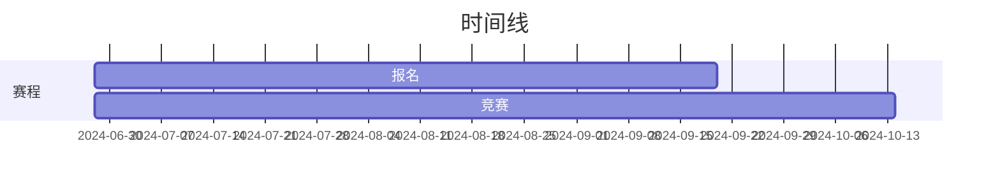

### 基于信创的创新应用开发大赛

- [赛事链接](https://www.gitlink.org.cn/competitions/track1_XPlaza_application)
- 总奖金：10 万元


### 开源供应链安全挖掘赛

- [赛事链接](https://www.gitlink.org.cn/competitions/track4_datadigging)
- 总奖金：6.5 万元

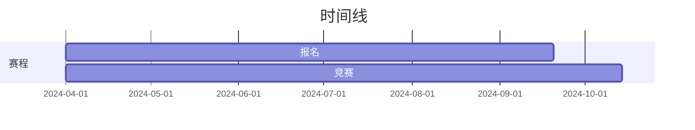

### ModelScope 开源模型应用挑战赛

- [赛事链接](https://www.gitlink.org.cn/competitions/track2_ModelScope)
- 总奖金：6 万元

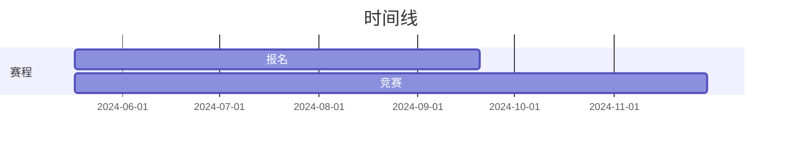

### Bio-OS 开源任务挑战赛

- [赛事链接](https://www.gitlink.org.cn/competitions/track2_Bio-OS)
- 总奖金：31.5 万元

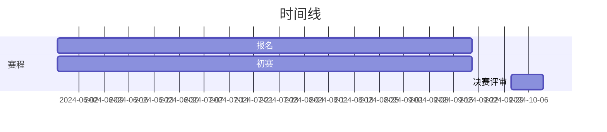

### 智能化开源漏洞工程赛

- [赛事链接](https://www.gitlink.org.cn/competitions/track4_vulnerability)
- 总奖金：6.5 万元


### “红山开源”数值仿真-开源任务挑战赛

- [赛事链接](https://www.osredm.com/competition/rjkf)
- 总奖金：14 万元

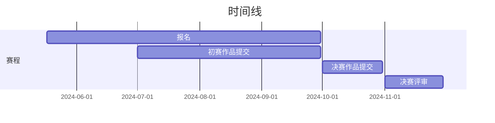

### CrowdOS 开源项目贡献赛

- [赛事链接](https://www.gitlink.org.cn/competitions/track1_CrowdOS)
- 总奖金：3 万元

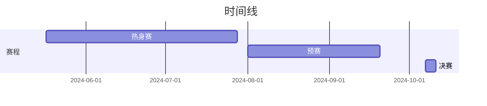

### “红山开源”大模型创意应用-开源任务挑战赛

- [赛事链接](https://www.osredm.com/competition/cyyy)
- 总奖金：10 万元

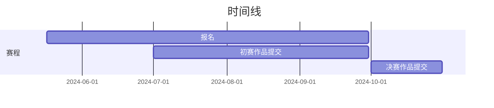

### RepoSyncer 跨平台同步项目贡献赛

- [赛事链接](https://www.gitlink.org.cn/competitions/track1_RepoSyncer)
- 总奖金：8 万元


### “红山开源”大模型基础能力提升-开源任务挑战赛

- [赛事链接](https://www.osredm.com/competition/zswd)
- 总奖金：20 万元

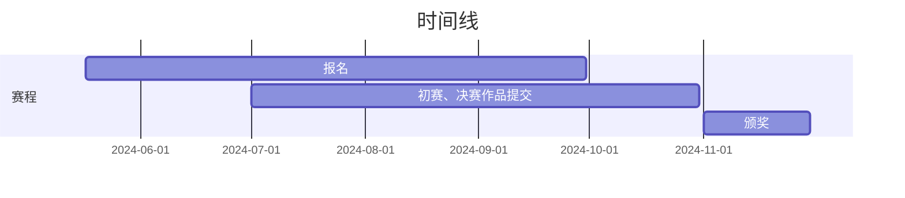

### 昇思 MindSpore 开源任务挑战赛

- [赛事链接](https://www.gitlink.org.cn/competitions/track2_MindSpore)
- 总奖金：10 万元

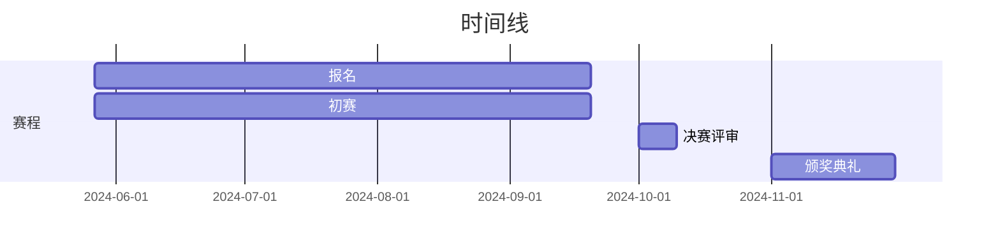

### Cantian 开源项目贡献赛

- [赛事链接](https://www.gitlink.org.cn/competitions/track1_Cantian)
- 总奖金：10 万元

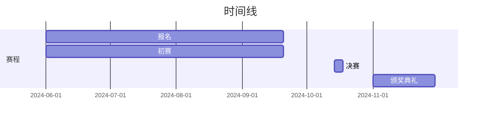

### openEuler 开源项目贡献赛

- [赛事链接](https://www.gitlink.org.cn/competitions/track1_openEuler)
- 总奖金：10 万元

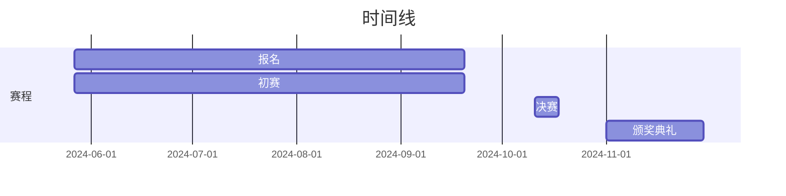

### 香山核开源项目贡献赛

- [赛事链接](https://www.gitlink.org.cn/competitions/track1_xiangshanhe)
- 总奖金：3.3 万元


### openInula 开源项目贡献赛

- [赛事链接](https://www.gitlink.org.cn/competitions/track1_openInula)
- 总奖金：10 万元

```mermaid
gantt
    title 时间线
    dateFormat YYYY-MM-DD
    section 赛程
        报名截止:  2024-09-20
        初赛:  2024-06-01, 2024-09-20
        初赛评审:  2024-09-23, 2024-09-30
        初赛结果公布: 2024-10-09
        决赛评审:  2024-10-14, 2024-10-18
        颁奖典礼: 2024-11-01, 2024-11-30
```

### OpenTiny 开源项目贡献赛

- [赛事链接](https://www.gitlink.org.cn/competitions/track1_openTiny)
- 总奖金：10 万元

```mermaid
gantt
    title 时间线
    dateFormat YYYY-MM-DD
    section 赛程
        报名截止:  2024-09-20
        初赛:  2024-05-27, 2024-09-20
        初赛评审:  2024-09-21, 2024-09-30
        决赛评审:  2024-10-01, 2024-10-10
        颁奖典礼: 2024-11-01, 2024-11-30
```

### OpenHarmony 应用开发-开源项目贡献赛

- [赛事链接](https://www.gitlink.org.cn/competitions/track1_OpenHarmony_kaihong)
- 总奖金：10 万元

```mermaid
gantt
    title 时间线
    dateFormat YYYY-MM-DD
    section 赛程
        报名截止:  2024-09-20
        初赛:  2024-05-27, 2024-09-20
        初赛评审:  2024-09-21, 2024-09-30
        决赛评审:  2024-10-01, 2024-10-10
        颁奖典礼: 2024-11-01, 2024-11-30
```

### OpenHarmony 操作系统-开源项目贡献赛

- [赛事链接](https://www.gitlink.org.cn/competitions/track1_OpenHarmony_Huawei)
- 总奖金：10 万元

```mermaid
gantt
    title 时间线
    dateFormat YYYY-MM-DD
    section 赛程
        报名截止:  2024-09-20
        初赛:  2024-05-27, 2024-09-20
        初赛评审:  2024-09-21, 2024-09-30
        决赛评审:  2024-10-01, 2024-10-10
        颁奖典礼: 2024-11-01, 2024-11-30
```

### 2024 开源之夏

- [赛事链接](https://summer-ospp.ac.cn/)
- 总奖金：-

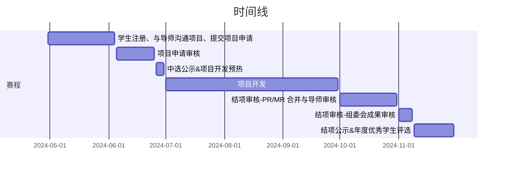

### “千帆杯”AI 原生应用 教育生态行业赛

- [赛事链接](https://cloud.baidu.com/qianfandev/topic/269711)
- 总奖金：20 万元

```mermaid
gantt
    title 时间线
    dateFormat YYYY-MM-DD
    section 赛程
        组队&报名:  2024-04-01, 2024-06-24
        线上赛: 2024-04-01, 2024-06-24
        决赛（待定）:  2024-07-01, 7d
```

### IJCAI 2024: 任意三维几何外形车辆的风阻快速预测竞赛

- [赛事链接](https://competition.atomgit.com/competitionInfo?id=7f3f276465e9e845fd3a811d2d6925b5)
- 总奖金：3.5 万元

```mermaid
gantt
    title 时间线
    dateFormat YYYY-MM-DD
    section 赛程
        组队&报名: 2024-04-23, 2024-07-08
        开放样例数据下载: 2024-04-23, 2024-05-01
        完整数据开放下载: 2024-05-01, 2024-05-21
        公榜开放提交: 2024-05-21, 2024-07-07
        报名和团队合并截止，代码提交开放: 2024-07-07, 2024-07-14
        公布最终成绩: 2024-07-21, 1d
```

### 金蝶云·苍穹追光者开发大赛

- [赛事链接](https://dev.kingdee.com/active/competition/2024)
- 总奖金：待更新

```mermaid
gantt
    title 时间线
    dateFormat YYYY-MM-DD
    section 企业赛道 创新赛道 赛程
        参赛招募: 2024-04-01, 2024-06-30
        初赛海选: 2024-07-01, 2024-09-30
        复赛评选: 2024-09-01, 2024-11-30
        决赛路演: 2024-12-01, 2024-12-14
        荣誉加冕: 2025-02-01, 2025-02-28
    section 院校赛道
        参赛招募: 2024-04-01, 2024-04-30
        大赛启动: 2024-05-01, 2024-05-31
        大赛赋能: 2024-06-01, 2024-06-30
        初赛评选: 2024-07-01, 2024-07-31
        决赛路演: 2024-08-01, 2024-08-31
```

### Founder Park x 飞书 AGI 应用 hAIkathon

- [赛事链接](https://bytedance.larkoffice.com/wiki/LzxLwouvoi7y9kkxhJ3cxSt8nge)
- 总奖金：进入决赛的 20 支队伍，均可获得 NVIDIA 4090 一台，奖金额待更新

```mermaid
gantt
    title 时间线
    dateFormat  YYYY-MM-DDTHH:mm

    section 赛程
        开发、报名参赛: 2024-06-02T00:00, 2024-06-10T20:00
        初赛评选: 2024-06-10T20:00, 2024-06-12T00:00
        初版产品 demo 提交: 2024-06-12T00:00, 2024-06-16T20:00
        复赛结果公布: 2024-06-18T00:00, 2024-06-22T00:00
        封闭开发: 2024-06-22T00:00, 2024-06-23T00:00
        决赛路演: 2024-06-23T00:00, 2024-06-24T00:00
```

### Mozilla Builders

- [项目链接](https://future.mozilla.org/builders/)
- 总奖金：高达 100,000 美元的非稀释资金(up to $100,000 in non-dilutive funding)

```mermaid
gantt
    title 时间线
    dateFormat  YYYY-MM-DD

    section 赛程
        Early Application: 2024-06-03, 2024-06-08
        Final Application: 2024-06-03, 2024-08-01
        12-week program: 2024-09-12, 2024-12-05
        Demo Day: 2024-12-05, 2024-12-05
```

### gitee AI & 天数智芯 AI 创新应用大赛

- [项目链接](https://ai.gitee.com/events/iluvatar-ai-app-contest)
- 总奖金：20 万元

```mermaid
gantt
    title 时间线
    dateFormat  YYYY-MM-DD

    section 赛程
        报名参赛: 2024-06-01, 2024-07-20
        提交应用: 2024-07-22, 2024-08-22
        网络投票: 2024-08-26, 2024-09-06
        专家评审: 2024-09-07, 2024-09-21
```
