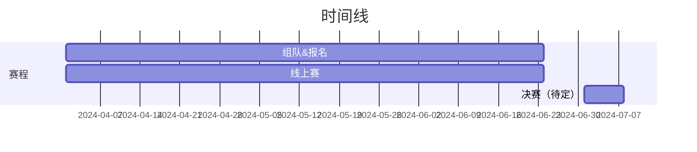
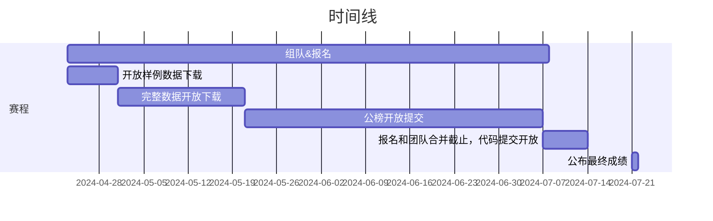

# Koala 开源俱乐部

  

欢迎来到 Koala 开源俱乐部的赛事信息收集平台。我们致力于为广大技术爱好者提供最新、最全的代码赛事信息及参赛思路，并为大家提供一个便捷的组队平台。

无论你是想寻找合适的比赛参与，还是希望结识志同道合的队友，抑或是获取比赛指导，这里都能满足你的需求。

对于赛事的主办方，欢迎在此提交 PR 发布赛事信息，也欢迎联系我们合作发布赛事推广、培训视频，提升参赛作品质量，解决主办方的真问题。

## 我们是谁

本仓库由 Bilibili 视频 Up 主 [Koala 聊开源](https://space.bilibili.com/489667127)创建，我们长年发布开源技术相关的[深度分析](https://space.bilibili.com/489667127/channel/collectiondetail?sid=410578)、[科技周报](https://space.bilibili.com/489667127/channel/collectiondetail?sid=249279)和[科技快报](https://space.bilibili.com/489667127/channel/collectiondetail?sid=3083183)，至今已超过 1000 天，更多信息也可以在频道[首期视频](https://www.bilibili.com/video/BV1CL4y1e7C1)中了解。

在过去几年中，我们被粉丝小伙伴们的学习热情所打动，近期发起了 Koala 开源俱乐部活动，目标是帮助小伙伴们开发有难度、有创新性、有实用价值的项目，而参加赛事无疑是一举多得的机会，因此我们创建这个仓库，让更多的小伙伴可以参与进来。

## 赛事信息

- [如何添加赛事信息](./add-a-hackathon.md)
- [如何发起组队](./find-your-team-member.md)

### “千帆杯”AI 原生应用 教育生态行业赛

- [赛事链接](https://cloud.baidu.com/qianfandev/topic/269711)
- 总奖金：20 万元

### IJCAI 2024: 任意三维几何外形车辆的风阻快速预测竞赛

- [赛事链接](https://competition.atomgit.com/competitionInfo?id=7f3f276465e9e845fd3a811d2d6925b5)
- 总奖金：3.5 万元

